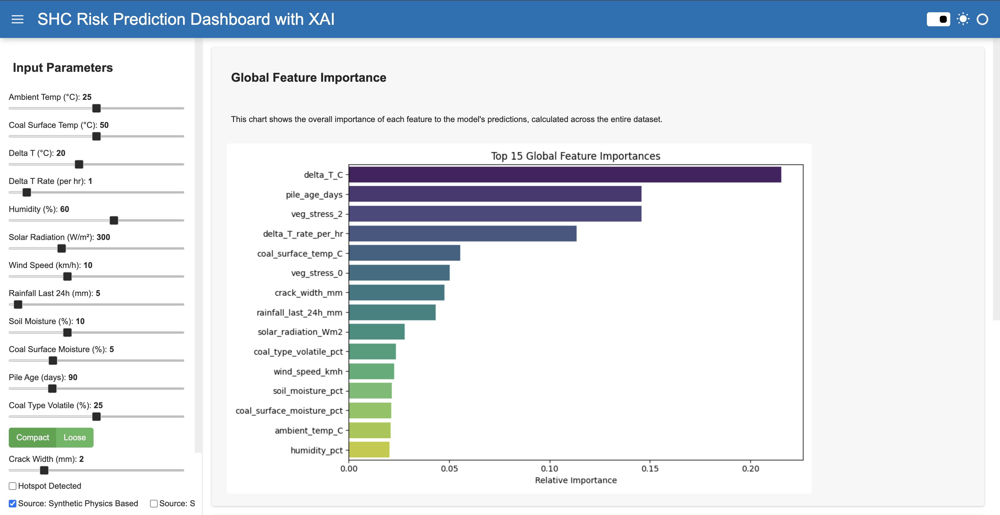
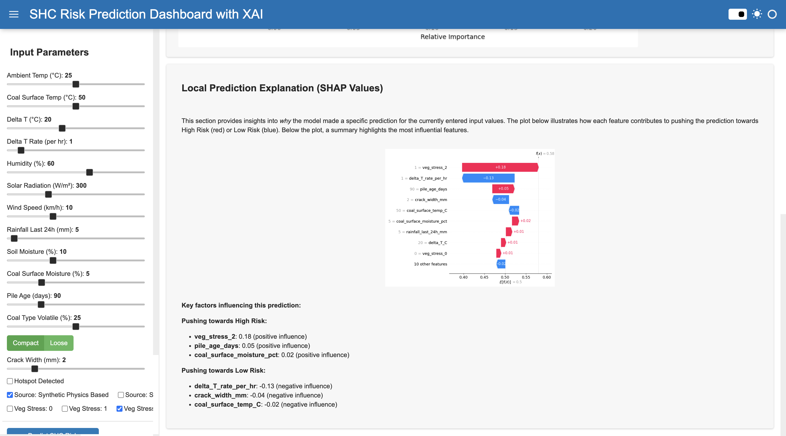

# SHC Risk Prediction Dashboard with Explainable AI (XAI)

## Overview

This project presents an interactive dashboard for predicting the risk of Spontaneous Heating of Coal (SHC) using Machine Learning, specifically a Random Forest Classifier. The dashboard, built with `Panel`, not only provides real-time risk predictions based on user-defined environmental and coal pile parameters but also integrates Explainable AI (XAI) using SHAP (SHapley Additive exPlanations) to demystify the model's decisions. This allows users to understand *why* a particular risk prediction was made, fostering trust and enabling data-driven interventions.

## The Problem: Coal Mine Safety and Spontaneous Heating

Coal mining, while vital for energy, remains a hazardous industry. A significant, yet often insidious, threat is Spontaneous Heating of Coal (SHC). SHC occurs when coal oxidizes at low temperatures, gradually increasing its internal temperature until it ignites, leading to **underground fires, gas explosions, and potentially catastrophic accidents**. Such incidents not only result in immense economic losses due due to downtime and equipment damage but, more importantly, **endanger lives, causing injuries and fatalities among miners**.

According to various reports (e.g., from the U.S. Mine Safety and Health Administration (MSHA) or international mining bodies), incidents related to thermal events, including spontaneous combustion, contribute to a notable percentage of mine accidents and near-misses globally. While precise, up-to-date global statistics on SHC-specific fatalities are challenging to isolate from broader categories like 'fires and explosions', the potential for severe consequences is universally recognized.

**This model directly addresses this critical safety concern by providing an early warning system.** By predicting SHC risk based on observable parameters, mine operators can take proactive measures, such as adjusting pile management, enhancing ventilation, or cooling affected areas, thereby significantly **reducing the likelihood of SHc-related fires and protecting the lives of miners.**

## Solution Overview

The dashboard provides an intuitive interface where users can adjust various parameters related to coal piles and environmental conditions. The machine learning model processes these inputs to predict the SHC risk (High or Low) and the probability of high risk. Crucially, the integrated XAI component explains these predictions, highlighting which features contributed most to the outcome.

## Visual Overview

Here are some screenshots showcasing the dashboard's interface and functionality:

### Interactive Input and Prediction

*Adjust parameters and receive real-time SHC risk predictions.*

### Explainable AI (XAI) Insights

*Understand the model's decision-making process with SHAP waterfall plots and feature importance.*


## Key Features

*   **Interactive Input Widgets**: Easily adjust environmental, coal pile, and coal type parameters.
*   **Real-time SHC Risk Prediction**: Get immediate classification (High/Low Risk) and probability scores.
*   **Global Feature Importance**: Understand which features are generally most influential for the model.
*   **Local Prediction Explanations (SHAP)**: See a breakdown of how each feature's value impacts a specific prediction.
*   **Modular Codebase**: Organized into separate Python scripts for data preprocessing, model training, and dashboard deployment.
*   **Professional Aesthetics**: Utilizes `Panel`'s `FastListTemplate` for a clean and responsive user interface.

## Project Structure

```
my_shc_project/
├── data/
│   └── coal_shc_dataset_synthetic_v1_1.csv  (Raw data)
├── notebooks/
│   └── shc_analysis_and_modeling.ipynb    (Original exploratory notebook)
├── src/
│   ├── __init__.py                        (Makes 'src' a Python package)
│   ├── data_preprocessing.py              (Handles data loading and cleaning)
│   ├── model_training.py                  (Contains model training and saving logic)
│   └── dashboard_app.py                   (The Panel dashboard application)
├── models/
│   ├── trained_shc_model.pkl              (Saved trained ML model)
│   ├── feature_columns.pkl                (List of feature names used by the model)
│   └── feature_importances.pkl            (Saved global feature importances)
├── run_training.py                      (Script to run data preprocessing and model training)
├── requirements.txt                     (Python dependencies)
├── docs/
│   └── images/                          (Contains project screenshots)
│       ├── Screenshot 2026-07-27 at 12.43.17 AM.png
│       └── Screenshot 2026-07-27 at 12.43.29 AM.png
└── README.md                            (This file)
```

## Setup and Local Execution

Follow these steps to set up and run the SHC Risk Prediction Dashboard on your local machine.

### 1. Clone the Repository (if applicable)

```bash
git clone <your-repository-url>
cd my_shc_project
```

### 2. Create a Virtual Environment (Recommended)

```bash
python -m venv venv
source venv/bin/activate  # On Windows: .\venv\Scripts\activate
```

### 3. Install Dependencies

Install all necessary Python packages listed in `requirements.txt`:

```bash
pip install -r requirements.txt
```

### 4. Prepare the Data

Ensure your `coal_shc_dataset_synthetic_v1_1.csv` file is placed in the `data/` directory.

### 5. Train the Model

Run the `run_training.py` script from the project root to preprocess the data, train the model, and save all necessary artifacts (model, feature columns, feature importances) to the `models/` directory.

```bash
python run_training.py
```

This will output model evaluation metrics and confirm that artifacts have been saved.

### 6. Serve the Dashboard

Navigate into the `src/` directory and run the `dashboard_app.py` using `panel serve`:

```bash
panel serve src/dashboard_app.py --show
```

This command will open the dashboard in your default web browser. You can then interact with the widgets, get predictions, and explore the XAI explanations.

## Technologies Used

*   **Python**: Programming language
*   **Pandas**: Data manipulation and analysis
*   **NumPy**: Numerical operations
*   **Scikit-learn**: Machine learning model (Random Forest Classifier)
*   **Imbalanced-learn (imblearn)**: Handling class imbalance (SMOTE)
*   **Panel**: Interactive dashboard creation
*   **SHAP**: Explainable AI (XAI) for model interpretability
*   **Matplotlib / Seaborn**: Plotting and visualization
*   **Joblib**: Model persistence (saving/loading)

## Future Enhancements

*   **Real-time Data Integration**: Connect to live sensor data for continuous monitoring.
*   **Anomaly Detection**: Implement additional algorithms to detect unusual patterns.
*   **Historical Data Analysis**: Allow users to visualize trends and past predictions.
*   **User Authentication**: Secure access to the dashboard.
*   **Deployment**: Deploy the dashboard to a cloud platform (e.g., Google Cloud, AWS, Azure) for broader access.

## License

(Consider adding a license file, e.g., MIT, if you plan to share this publicly.)
